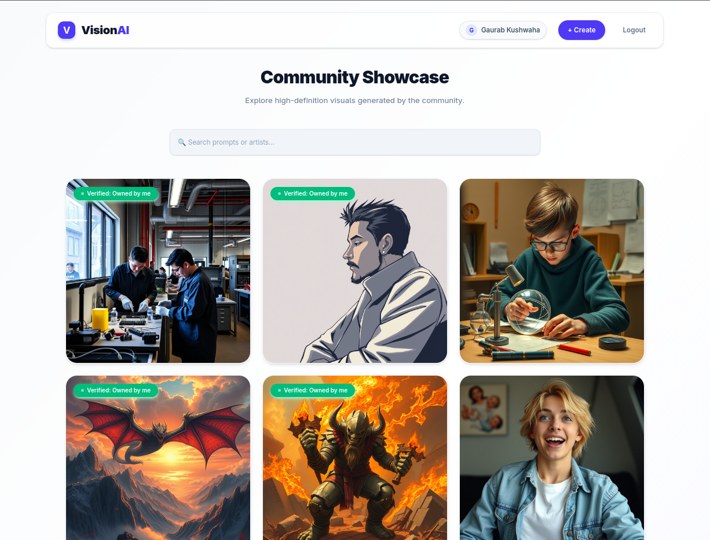
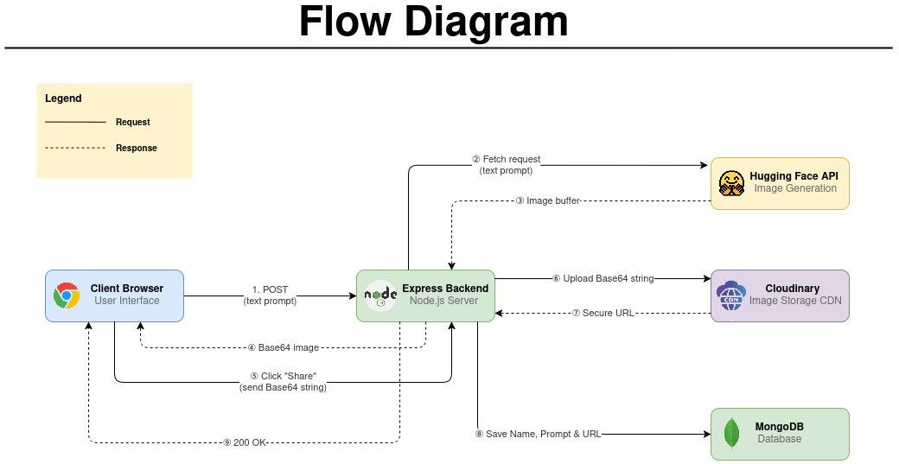
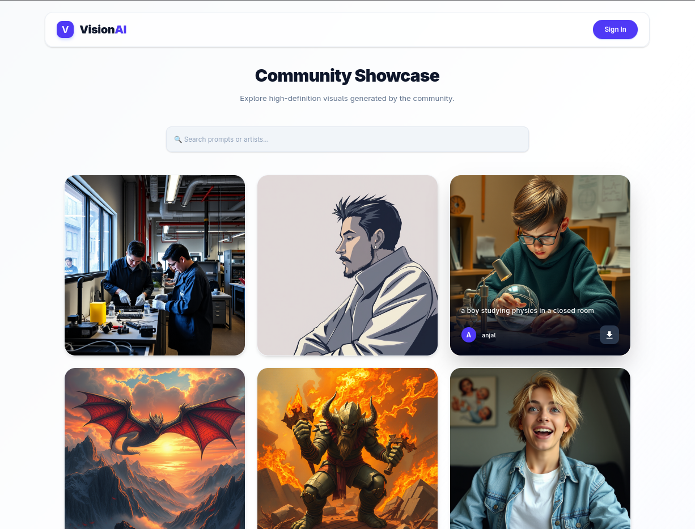
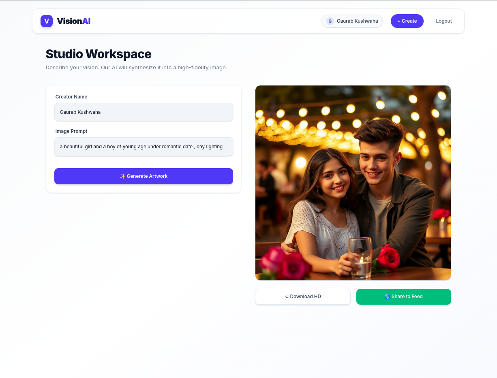

# VisionAI

 
**VisionAI** is a high-performance, decoupled full-stack application that leverages advanced Deep Learning models for real-time text-to-image synthesis. Built with a modern JavaScript stack, it provides a seamless user interface for generating, optimizing, and sharing AI-created visual assets within a community-driven gallery.

---

## ⚙️ System Architecture

 

The platform utilizes a **Decoupled Client-Server Architecture**:
*   **Frontend (Thick Client):** A standalone React SPA handling state, routing, and UI rendering.
*   **Backend (RESTful API):** An Express.js server acting as the controller layer, handling secure communication between the client, the AI inference engine, and cloud storage solutions.

## 🛠 Technology Stack

### Frontend (Client)
*   **Core:** React.js, Vite (for rapid HMR and optimized builds)
*   **Styling:** Tailwind CSS
*   **Deployment:** Vercel

### Backend (Server)
*   **Core:** Node.js (v18 LTS), Express.js
*   **Communication:** **Nodemailer** (Integrated for automated email notifications and user alerts)
*   **Deployment:** AWS EC2 (Linux)

### Database & Cloud Assets
*   **Database:** MongoDB Atlas (NoSQL for flexible metadata schemas)
*   **Asset Management:** Cloudinary (On-the-fly image optimization and secure hosting)

### AI Integration
*   **Inference Engine:** Hugging Face Inference API (FLUX.1-schnell)

---

## ✨ Core Features

*   **Real-Time AI Synthesis:** Converts descriptive text prompts into high-fidelity images with minimal latency.
*   **Optimized Asset Delivery:** Bypasses heavy database loads by piping raw AI output directly to Cloudinary, reducing data payload by >80% and serving optimized URLs.
*   **Community Gallery:** A dynamic, searchable feed displaying all community-generated artworks with associated metadata (prompts and creator tags).
*   **Cross-Origin Security:** Configured with robust CORS middleware to ensure the AWS backend only accepts traffic from the Vercel-hosted frontend domain.
*   **Asynchronous State Handling:** Implements custom skeleton loaders and UX states to mask the 10-15 second AI generation window.

---

## 📸 Application Screenshots

| Home Gallery | Generation Interface |
| :---: | :---: |
|  |  | 
<!-- ADD SCREENSHOTS ABOVE -->

---

## 🔭 Future Roadmap

*   **Authentication & Profiles:** Integration of JWT/Auth0 for private user dashboards and saved collections.
*   **Advanced AI Tooling:** Implementation of in-painting and out-painting capabilities.
*   **Serverless Scaling:** Migrating heavy API routes to AWS Lambda for automated load handling during peak usage.

---

## 👨‍💻 Author

**Gaurab Kushwaha** 
*   [GitHub](https://github.com/gaurabsingh012)
*   [LinkedIn](https://www.linkedin.com/in/gaurab-kushwaha-837237285/)

---
*Developed as a high-performance MERN implementation demonstrating modern AI integration.*